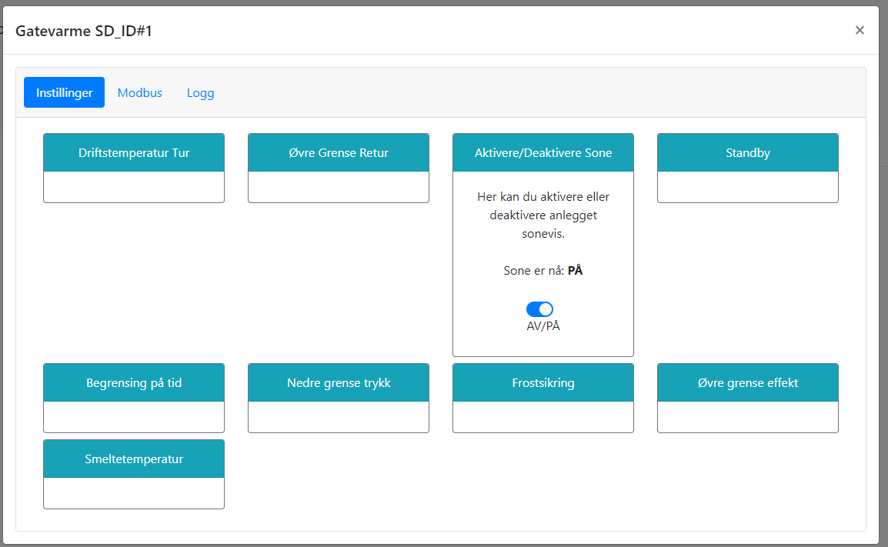

# Aktiverere/Dekativere snøsmelting

@fig:aktivere_deaktivere viser hvordan snøsmelting kan aktiveres eller deaktiveres. Dersom anlegget settes inaktivt vil all styringslogikk slås av, og anlegget vil ikke starte opp selv om det er snøfall. Dette kan være nyttig dersom et anlegg eller deler av et anlegg skal stenges for sesongen, eller ved feilsøking. I motsetning til manuell drift, vil anlegget opprettholde stautus som aktivert eller deaktivert ved omstart.

{#fig:aktivere_deaktivere}

```{=latex}
\newpage
```
