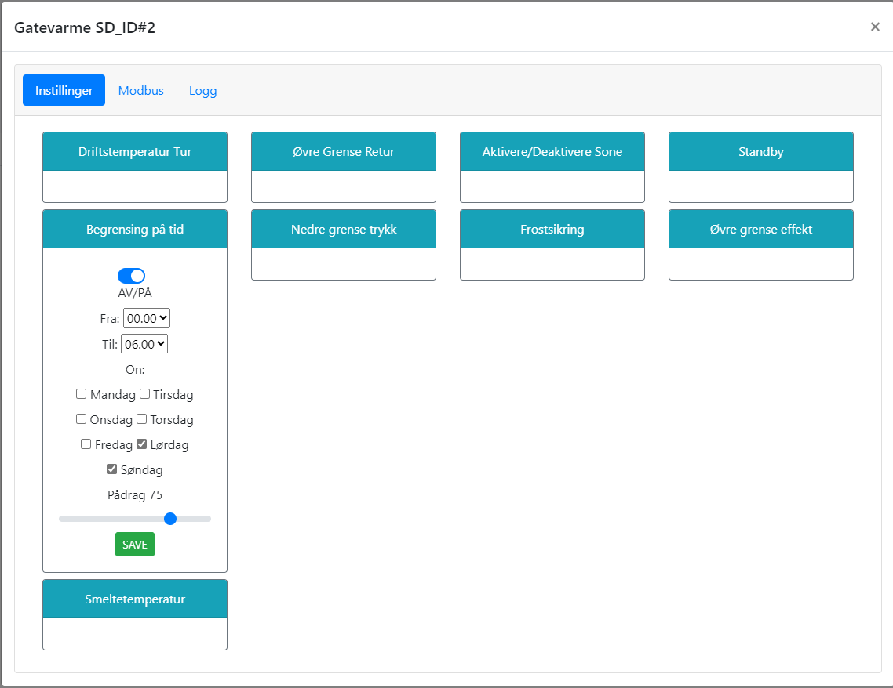

# Begrense pådrag innenfor tidsrom

@fig:time_bounded_drive viser hvordan man kan begrense pådrag innenfor et gitt tidsrom. Dette kan være nyttig i perioder hvor man ønsker å begrense effektforbruket midlertidig, for eksempel i perioder med høy strømpris eller i tidsrom der andre systemer skal ha høyere prioritet. Innenfor det valgte tidsrommet vil anlegget regulere som normalt, men pådraget vil være begrenset til det som er satt i konfigurasjonen.

{#fig:time_bounded_drive}

```{=latex}
\newpage
```
