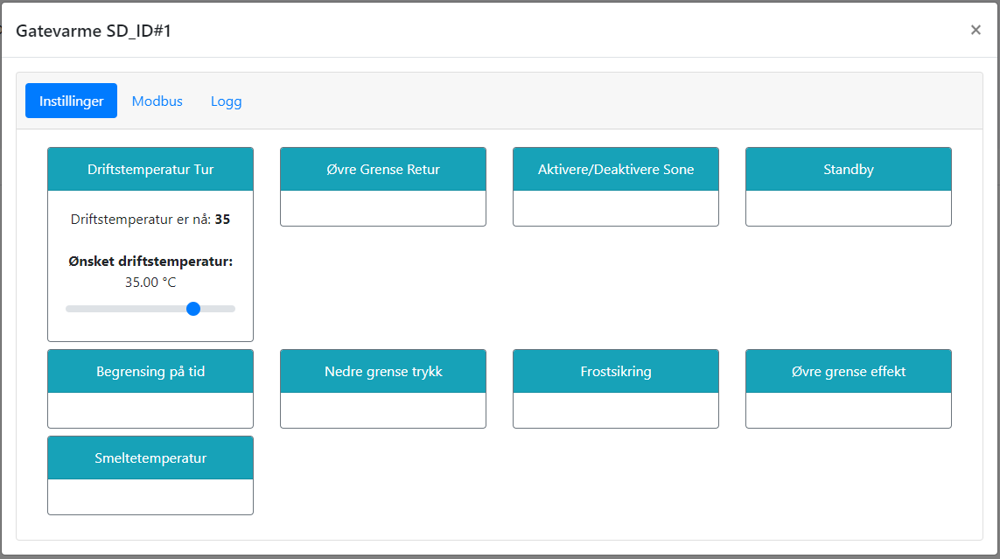

# Driftstemperatur - Tur

@fig:sette_temp_tur viser hvordan driftstemperatur på tur sekundærside settes (T25). Siden pådraget reguleres basert på flere kriterier, vil dette i praksis fungere som en makstemperatur.

{#fig:sette_temp_tur}

```{=latex}
\newpage
```
