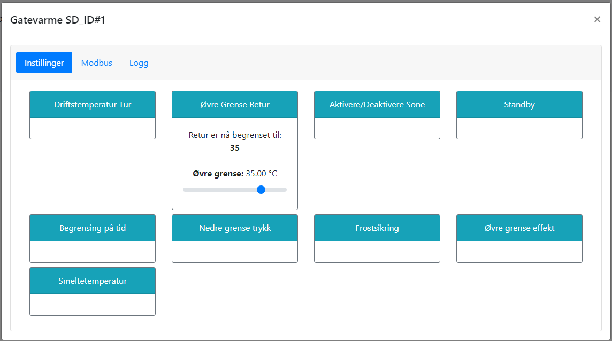

# Driftstemperatur - Retur

@fig:sette_temp_retur viser hvordan driftstemperatur på retur sekundærside settes (T26). Siden pådraget reguleres basert på flere kriterier, vil dette i praksis fungere som en makstemperatur.

{#fig:sette_temp_retur}

```{=latex}
\newpage
```
