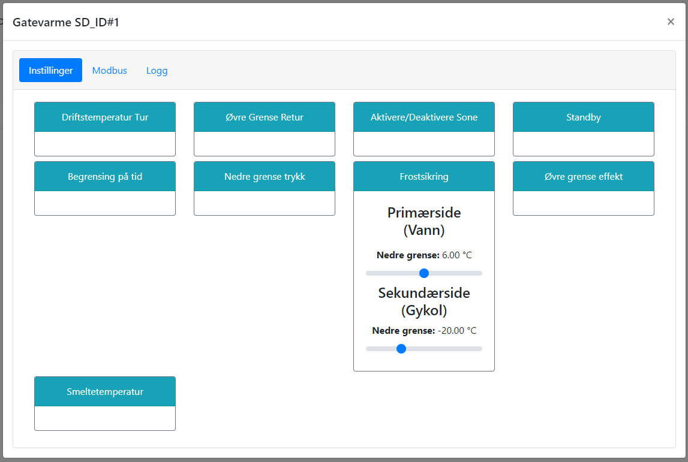

# Frostsikring

@fig:frostsikring viser hvordan man setter temperaturgrenser for frostsikring. Det er mulig å endre disse grensene både for primær- og sekundærsirkulasjon.

Frostsikring på primærsiden hindrer at vannet i veksleren fryser når kald gykol tilføres under oppstart. Denne bør ligge noe over frysepunktet for vann, med margin for treg respons i anlegget. Dersom temperaturen på T24 faller under denne grensen, vil 3-veis ventil på sekundærsiden lukkes. Det er derfor viktig at denne settes i forhold til hvor raskt varme kan tilføres anlegget. Dersom varme tilføres for tregt, kan dette utløse frostsikring, og ventilen vil aldri åpne. Dette kan føre til at anlegget aldri kommer i drift. I slike tilfeller må grensen for frostsikring justeres ned, men dette må kun gjøres når anlegget er under oppsyn og av kvalifisert personell. I tillegg bør slike justeringer gjøres vinterstid når glykolen er kald, slik at det er mulig å teste at anlegget starter opp igjen etter justering uten at veksler fryser.

Frostsikring på sekundærsiden hindrer at glykolen blir for kald. Dersom anlegget er avlslått vil det starte opp dersom temperaturen mellom rørerne faller under denne grensen. Anlgget vi kjøre inntil temperaturen mellom rør måles til 1 grad over terskelen, og deretter gå over til normale kriterier for oppstart. Grensen bør settes basert på type glykol i anlegget.

{#fig:frostsikring}

```{=latex}
\newpage
```
