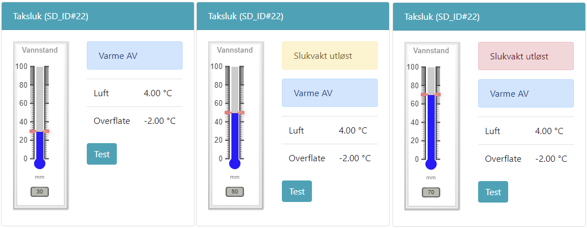

# Slukvakt

@fig:slukvakt viser varsling av for høy vannstand. Ultralyd i matter rundt sluket måler vannstand, og gir gult eller rødt varsel på display. Terskel for varsel kan justeres i konfigurasjonen ved levering.

{#fig:slukvakt}