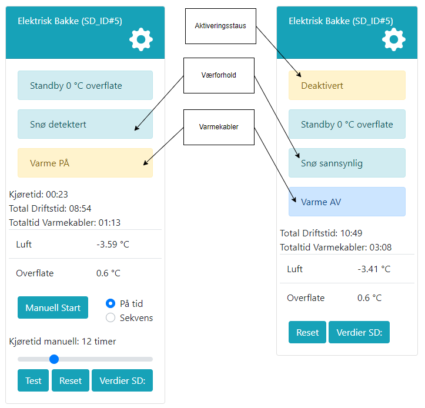
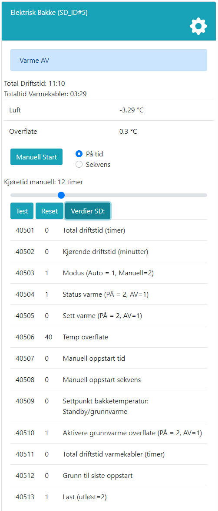

# Indikasjoner på frontpanel

@fig:el_indikasjoner viser hvordan frontpanelet på en elektrisk snøsmelteapplikasjon kan se ut. Her vises det at applikasjonen er aktivert, status på varmekabler, væforhold og temperaturer.

Kjøretid viser hvor lenge applikasjonen har kjørt dersom den er startet av oppstartskriterier. Total driftstid viser summen av dette siden siste nullstilling.

Selv om applikajsonen kjører, vil varmekablene kun være på dersom temperaturen i overflaten er under ønsket settpunkt. Derfor vises også totaltid for når varmekabler har vært på. Dette er en indikasjon på hvor mye effekt som er brukt.

{#fig:el_indikasjoner}

Ved å trykke på knappen merket "Verdier SD", kan man se gjeldende verdier og adresser for applikasjonen tilgjengelig via ModbusTCP (se @fig:el_modbus). Dette er nyttig for å feilsøke og for å se at applikasjonen er integrert riktig med toppsystem/SD-anlegg. Addresser settes på bakgrunn an applikasjonens ID, som tildeles stigende fra 1 for hver applikasjon. Protokollen for ModbusTCP beskrives i eget dokument.

{#fig:el_modbus width=60%}