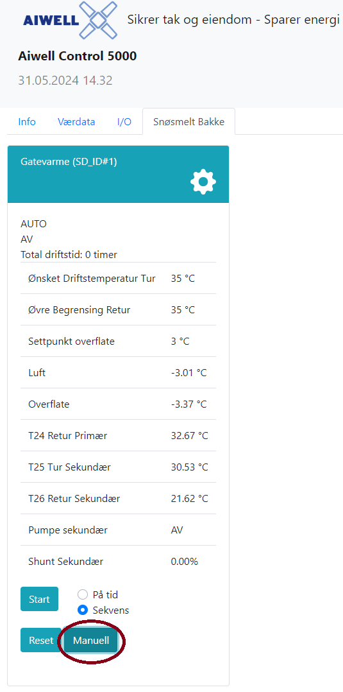
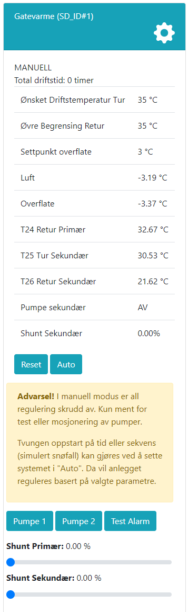

# Manuell drift

Det er viktig å påpeke at manuell drift kun bør benyttes i spesielle tilfeller, for eksempel ved feilsøking eller vedlikehold. Ved manuell drift vil anlegget ikke regulere som normalt, og det er derfor viktig å gå tilbake til automatisk drift så snart som mulig. Dette for å unngå unødvendig energiforbruk og for å sikre at anlegget fungerer som det skal og ikke tar skade på grunn av overoppheting eller frostdannelse. Dersom man ønsker å starte anlegget uten at snø er detektert, anbefales det å benytte tvangskjøring på tid eller sekvens.

[-@fig:sett_manuell] viser hordan man setter applikasjonen i manuell drift ved å trykke på knappen merket "Manuell" i web-grensesnittet.

@fig:function_manuell viser de ulike funksjonene som blir tilgjengelig under manuell drift. I manuell modus kan pådrag settes og pumper/aktuatorer slås av/på på primær- og sekundærside. Merk at ikke alle disse funksjonene er tilgjengelig for alle anlegg, og at det kan være forskjeller i funksjonalitet mellom ulike anlegg.

Det er mulig å sende en test-alarm fra web-grensesnittet for å sjekke at varsling fungerer som det skal. Dette kan være nyttig for å teste at alarm-relé og SMS-varsling fungerer som det skal, og at riktig driftsansvarlig mottar varsling ved alarm. Test-alarm utløser alarm-kode 6 i SD-anlegget.

Dersom man trykker på knappen merket "Auto", vil manuell drift avsluttes og anlegget vil gå tilbake til automatisk drift. Dersom man trykker på knappen merket "Reset", vil manuell drift avsluttes og anlegget vil gå tilbake til den driftsmodus som var aktiv før manuell drift ble startet. Reset vil også avbryte eventuelle pågående test-alarm og starte styringslogikk og sensoravlesning på nytt.

{#fig:sett_manuell width=60% }

{#fig:function_manuell width=50% }
