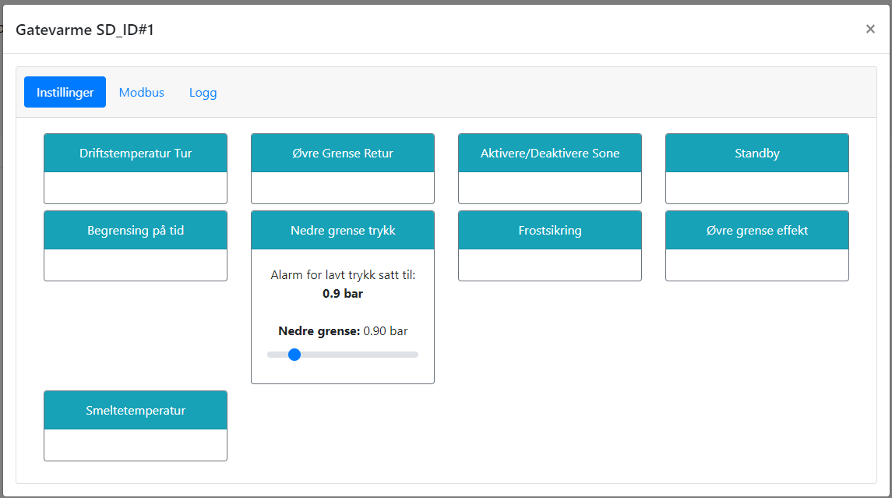

# Nedre grense - Trykk

@fig:trykkalarm viser hvordan en nedre grense for trykkalarm kan settes. Dette kan være nyttig for å unngå skade på anlegget ved for lavt trykk, eller for å oppdage lekasje. Dersom trykket faller under denne grensen, vil anlegget stoppe. Varsel på SMS kan også sendes til driftsansvarlig.

Dersom anlegget stoppers på grunn av for lavt trykk, må anlegget manuelt resettes fra web-grensesnittet, skjerm eller SD-anlegg. Dette for å unngå at anlegget starter opp igjen før årsaken til lavt trykk er utbedret.

{#fig:trykkalarm}

```{=latex}
\newpage
```
