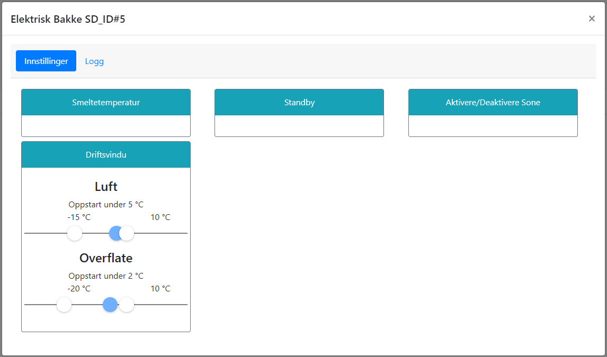

# Oppstart

For at anlegget skal starte på automatikk, må applikasjonen være aktivert, og temperaturer må ligge innenfor tillatt driftsområde (luft: mellom -15 og +10, overflate: mellom -15 og +10).

Når temperaturer er innenfor driftsområdet, vil anlegget starte opp i følgene situasjoner:

* Snø er detektert, overflate er under 2 grader og luft er under 5 grader.
* Snø er varslet, overflate er under 2 grader og luft er under 5 grader.
* Rim er sannsynlig, basert på luftfuktighet og bakketemperatur.
* Anlegget settes i Standby overflate er under 2 grader og luft er under 5 grader.

Når anlegget er startet opp, vil applikajonen gå til sluttkriterier er møtt, eller temperaturer går utenfor driftsområdet. At applikasjonen kjører betyr derimot ikke at varmekabler er på, siden dette reguleres basert på temperaturer.

@fig:el_driftsvindu viser hvordan man endrer instillingen for oppstartstemperaturer og driftsvindu. Trykk på tanhjulet for å komme til innstillinger, og trykk på boksen merket "Driftsvindu". Du vil da få opp et vindu hvor du kan sette ønskede temperaturgrenser. De blå sirklene styrer oppstartstemperaturer, mens de hvite markerer yttergrenser for driftsområdet.

{#fig:el_driftsvindu}

Dersom anlegget settes i Standby, har det ingen andre sluttkriterier enn at Standby deaktiveres, eller at temperaturer går utenfor driftsområdet. Standby-Modus bekrives i eget kapittel nedenfor.
