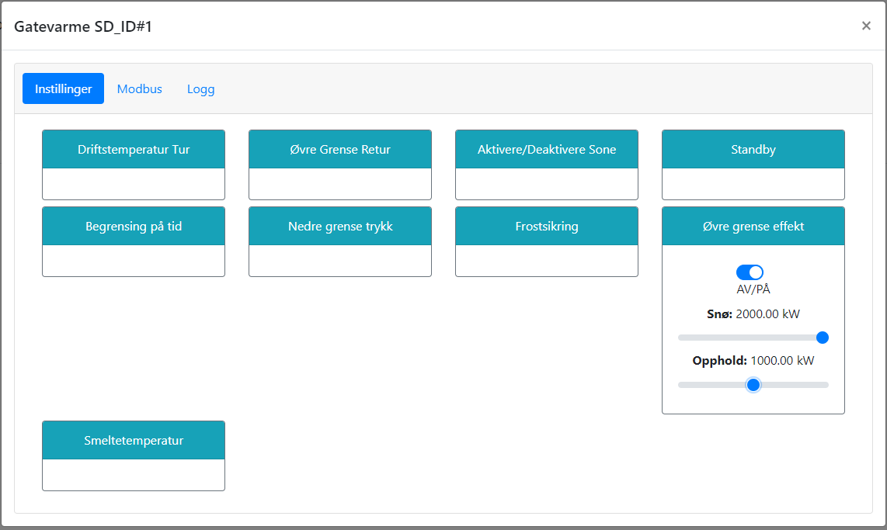

# Øvre grense - Effekt

@fig:effektgrense viser hvordan effektgrensen for snøsmelting kan settes. Dette kan vaære nyttig dersom fjernvarmeleveradøren opererer med effektgrenser eller fakturerer etter effekt. 

Effektgrense kan settes både for snøsmelting og oppholdsvær. Slik kan anlegget operere med lavere effekt i standby eller forstart på værprognoser, men øke effekten ved snøfall. Maks tillatt effektgrense settes i forkant av Aiwell basert på anleggets kapasitet og effektbehov. 

{#fig:effektgrense}

```{=latex}
\newpage
```
