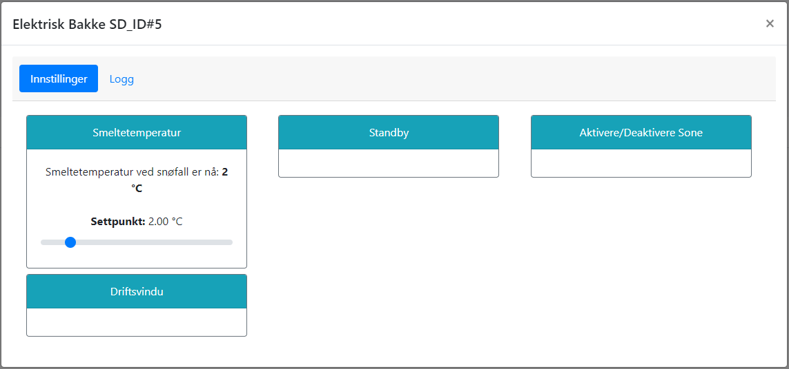

# Regulering

Etter oppstart vil anlegget regulere som en termostat. Settpunktet vil variere basert på værforhold og modus. Dersom anlegget er utstyrt med flere bakkefølere, vil reguleringen baseres på den kaldeste føleren.

Ved snøfall vil systemet forsøke å holde en smeltetemperatur på 3 grader i overflaten. 

@fig:el_setpoint viser hvordan man endrer ønsket smeltetemperatur. Trykk på tanhjulet for å komme til innstillinger, og trykk på boksen merket "Smeltetemperatur". Du vil da få opp et vindu hvor du kan sette ønsket settpunkt.

{#fig:el_setpoint}

Ved varslet snøfall vil overflatetemperatur holdes på 0.5-1 grad, og økes til 3 grader dersom snøfallet inntreffer, eventuelt stenges ned dersom snø ikke detekteres etter angitt tid (standard 3 timer).

Ved fare for rim vil overflatetemperatur holdes over duggpunktet.

I etterkant av snøfall vil systemet tørke overflaten ved å løfte temperaturen i overflaten til over 3 grader angitt antall ganger. Dersom det ikke er varmekapasitet til å nå overtstige 3 grader, vil systemet stenge ned etter 24 timer.