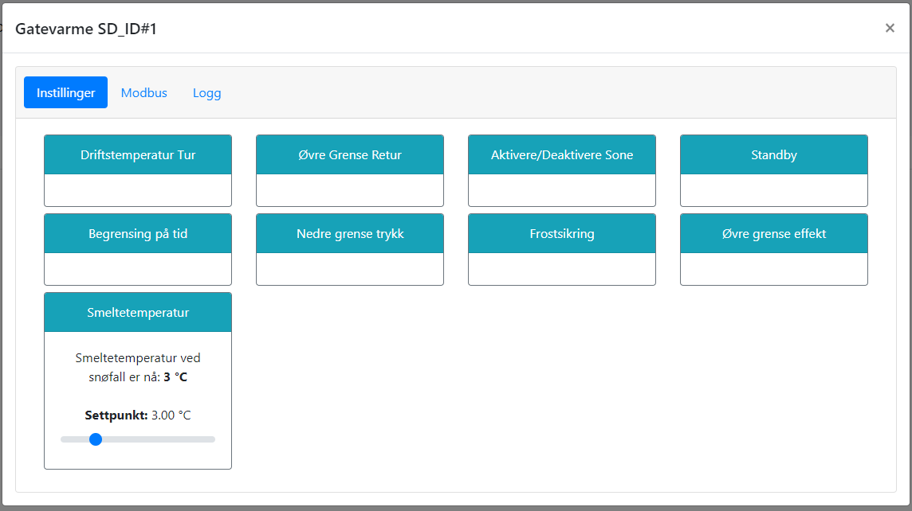

# Smeltetemperatur - Overflate

@fig:smeltetemp viser hvordan man setter ønsket smeltetemperatur for overflaten. Dette er temperaturen som overflaten skal holde på for å smelte snøen. Dersom det er flere følere i overflaten, vil det være den laveste temperaturen som gjelder.

{#fig:smeltetemp}

```{=latex}
\newpage
```
