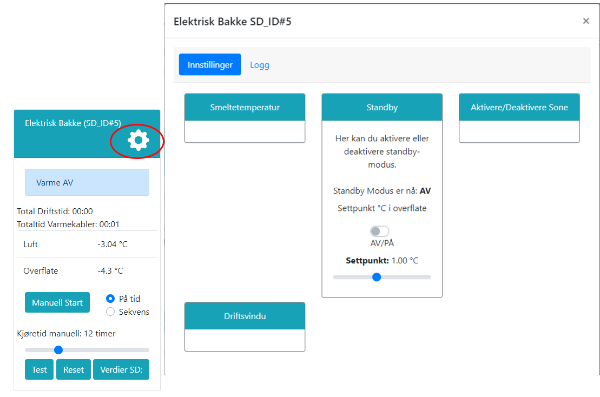
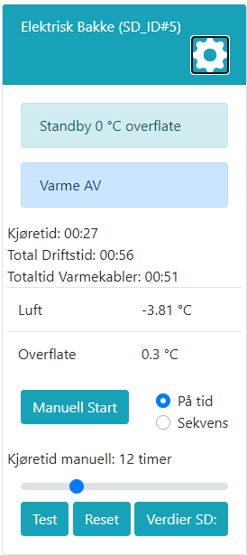

# Standby

Hensikten med Standby-modus er å holde på en grunnvarme i overflaten for å nå smeltetemperatur på rimelig tid ved snøfall. Dette kan være ønskelig for å unngå lang oppstart og høy effektbruk etter lengre perioder med opphold og lave temperaturer.

I Standby vil anlegget fortsatt regulere som en termostat, men med et lavere settpunkt. Varmekabler vil derfor kun være på dersom temperaturen i overflaten er under ønsket settpunkt. Opptimalt settpunkt vil avhenge av anleggets kapasitet og bakkens varme-egenksaper. Typisk vil settpunktet ligge på -1 til 0 grader, men dersom anlegget har kapasitet til å varme opp overflaten rask ved forventet snøfall, kan settpunktet settes lavere.

@fig:sette_standby viser hvordan man setter anlegget i Standby. Trykk på tanhjulet for å komme til innstillinger, og trykk på boksen merket "Stanby". Du vil da få opp et vindu hvor du kan sette ønsket settpunkt for Standby-modus, samt aktivere eller deaktivere funksjonen. Når anlegget er i Standby vil dette vises i displayet, se @fig:el_standby.

{#fig:sette_standby}

{#fig:el_standby width=40%}