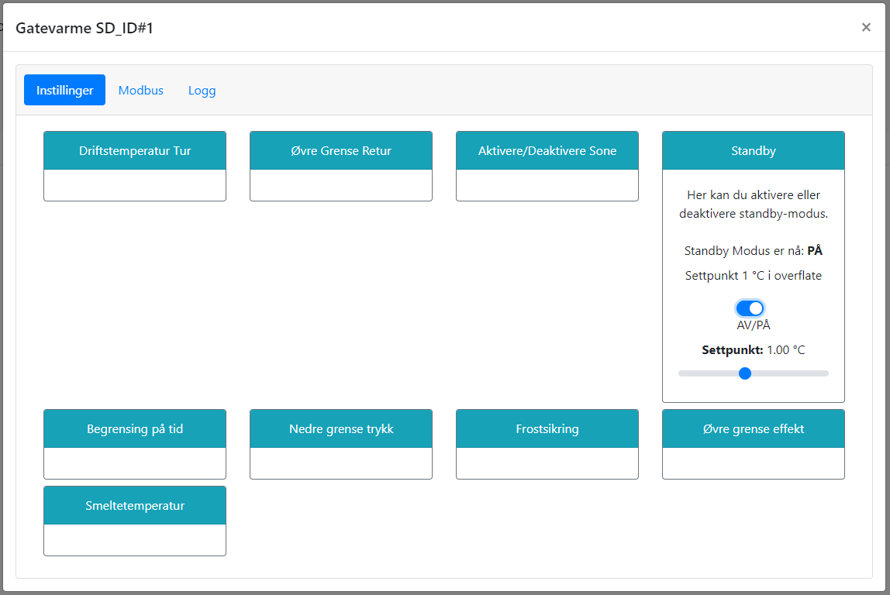

# Standby

@fig:standby_mode_setup viser hvordan man endrer settpunkt for overflate i standby-modus. Dette kan også være nyttig for å teste anlegget dersom temperaturen i overflaten er for høy til normal oppstart.

{#fig:standby_mode_setup}

```{=latex}
\newpage
```
