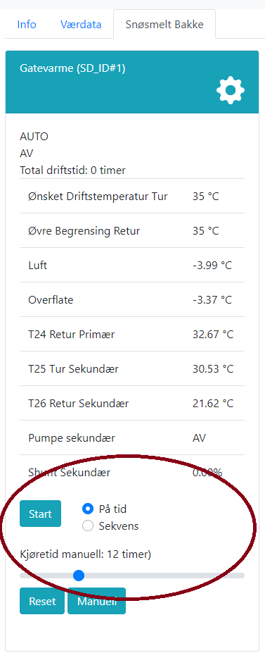
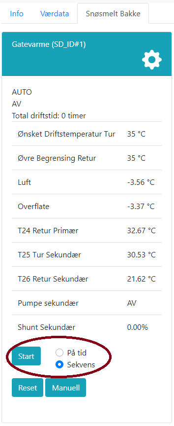

# Tvangskjøring på tid eller sekvens

Det er mulig å tvangsstarte anlegget på tid eller sekvens. Dette er anbefalt fremfor å sette anlegget i manuell drift, siden øvrig regulering da fortsatt vil være operativ. Ved oppstart på tid vil anlegget regulere som ved snøfall med samme temperaturgrenser. Ved oppstart på sekvens vil anlegget regulere som ved opptørk, men går over til snøsmelting ved detektert snøfall.

@fig:start_tid viser hvordan oppstart på tid kan gjøres fra web-grensesnittet. Når man trykker på knappen merket "På tid", vil det dukke opp en glidebryter der man kan velge hvor lenge anlegget skal stå på, inntil 48 timer.

@fig:start_sekvens viser hvordan oppstart på sekvens konfigureres i web-grensesnittet.

Etter å ha valgt type oppstart, vil anlegget gå i drift når man trykker på knappen merket "Start". Anlegget vil da gå i drift i henhold til valgt oppstarttype.

{#fig:start_tid width=60% }

{#fig:start_sekvens width=60% }
