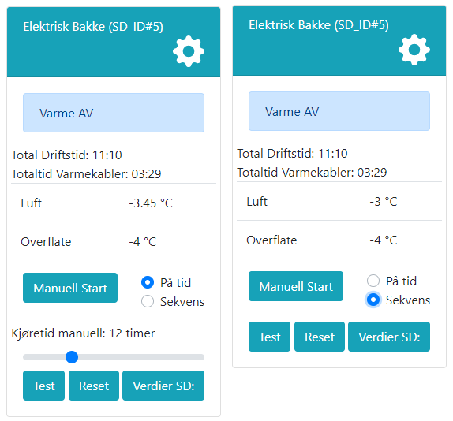

# Manuell start

Av sikkerhetsgrunner er det ikke mulig å kjøre varmekablene kontinuerlig med manuell overstyring. Ved test av anlegget vil det være mulig å sette anlegget i test-modus, som vil aktivere varmekablene, men disse vil slå seg av etter 15 minutter.

Manuell start i Auto-modus innebærer at anlegget simulerer et snøfall, og slår av og på varmekabler basert på temperatur i overflaten. @fig:el_man_start viser manuell start på tid og sekvens. Når anlegget starter på tid vil det regulere som om det snødde i det antall timer som settes. Ved manuell start på sekvens vil anlegget starte og går direkte til opptørksfasen, og løfte temperaturen i bakken det antall ganger som er konfigurert, eller etter maks antall timer som er satt for opptørk. Merk at varmekablene kun vil stå på hvis temperaturen i overflaten er under satt settpunkt for snøfall.

{#fig:el_man_start}