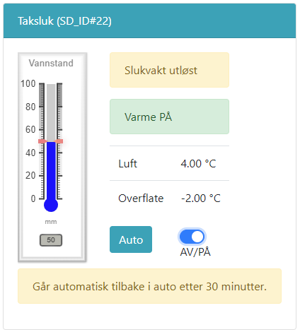

# Test av varmekabler

@fig:testvk viser en test av varmekabler. I testmodus er det mulg å teste at varmekablene fungerer som de skal. Av sikkerhetsgrunner er det ikke mulig å tvangskjøre varmekablene over tid. Etter 30 minutter vil varmekablene slå seg av og gå tilbake til automatisk logikk.

{#fig:testvk}